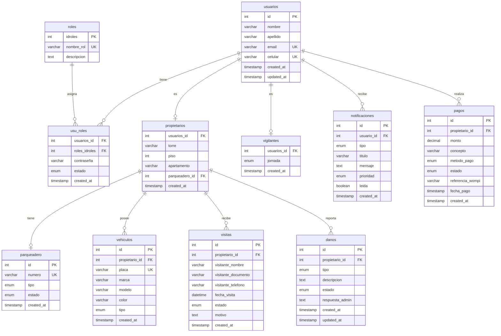

# 🗄️ Documentación de Base de Datos - Quintanares Residencial

Esta documentación describe la estructura completa de la base de datos del sistema de gestión de Quintanares Residencial.

## 📋 **Información General**

### **Configuración de Base de Datos**
- **Motor:** MySQL 5.7+ / MariaDB 10.3+
- **Charset:** utf8mb4
- **Collation:** utf8mb4_unicode_ci
- **Nombre:** sistema_vigilancia
- **Puerto:** 3306 (default)

### **Conexión**
```php
// Configuración en models/conexion.php
$host = 'localhost';
$username = 'parkovisko_user';
$password = 'tu_password_seguro';
$database = 'sistema_vigilancia';
$port = 3306;
```

## 📊 **Diagrama de Relaciones**



## 📋 **Estructura de Tablas**

### **👥 usuarios**
Tabla principal que almacena información de todos los usuarios del sistema.

```sql
CREATE TABLE `usuarios` (
  `id` int(11) NOT NULL AUTO_INCREMENT,
  `nombre` varchar(100) NOT NULL,
  `apellido` varchar(100) NOT NULL,
  `email` varchar(150) NOT NULL,
  `celular` varchar(20) NOT NULL,
  `created_at` timestamp NOT NULL DEFAULT CURRENT_TIMESTAMP,
  `updated_at` timestamp NOT NULL DEFAULT CURRENT_TIMESTAMP ON UPDATE CURRENT_TIMESTAMP,
  PRIMARY KEY (`id`),
  UNIQUE KEY `email` (`email`),
  UNIQUE KEY `celular` (`celular`)
) ENGINE=InnoDB DEFAULT CHARSET=utf8mb4 COLLATE=utf8mb4_unicode_ci;
```

**Campos:**
- `id` - Identificador único (PK)
- `nombre` - Nombre del usuario
- `apellido` - Apellido del usuario
- `email` - Correo electrónico (único)
- `celular` - Número de celular (único)
- `created_at` - Fecha de creación
- `updated_at` - Fecha de última actualización

**Índices:**
- **PRIMARY KEY:** `id`
- **UNIQUE:** `email`, `celular`

### **🔐 roles**
Define los tipos de roles disponibles en el sistema.

```sql
CREATE TABLE `roles` (
  `idroles` int(11) NOT NULL AUTO_INCREMENT,
  `nombre_rol` varchar(50) NOT NULL,
  `descripcion` text,
  PRIMARY KEY (`idroles`),
  UNIQUE KEY `nombre_rol` (`nombre_rol`)
) ENGINE=InnoDB DEFAULT CHARSET=utf8mb4 COLLATE=utf8mb4_unicode_ci;
```

**Campos:**
- `idroles` - Identificador único (PK)
- `nombre_rol` - Nombre del rol (administrador, vigilante, propietario)
- `descripcion` - Descripción del rol

**Datos por defecto:**
```sql
INSERT INTO `roles` (`nombre_rol`, `descripcion`) VALUES
('administrador', 'Acceso completo al sistema'),
('vigilante', 'Control de acceso y seguridad'),
('propietario', 'Gestión personal y pagos');
```

### **🔗 usu_roles**
Tabla de relación entre usuarios y roles, almacena credenciales.

```sql
CREATE TABLE `usu_roles` (
  `usuarios_id` int(11) NOT NULL,
  `roles_idroles` int(11) NOT NULL,
  `contraseña` varchar(255) NOT NULL,
  `estado` enum('activo','inactivo','suspendido') DEFAULT 'activo',
  `created_at` timestamp NOT NULL DEFAULT CURRENT_TIMESTAMP,
  PRIMARY KEY (`usuarios_id`,`roles_idroles`),
  KEY `fk_usu_roles_roles1_idx` (`roles_idroles`),
  CONSTRAINT `fk_usu_roles_roles1` FOREIGN KEY (`roles_idroles`) REFERENCES `roles` (`idroles`) ON DELETE CASCADE ON UPDATE CASCADE,
  CONSTRAINT `fk_usu_roles_usuarios1` FOREIGN KEY (`usuarios_id`) REFERENCES `usuarios` (`id`) ON DELETE CASCADE ON UPDATE CASCADE
) ENGINE=InnoDB DEFAULT CHARSET=utf8mb4 COLLATE=utf8mb4_unicode_ci;
```

**Campos:**
- `usuarios_id` - ID del usuario (FK)
- `roles_idroles` - ID del rol (FK)
- `contraseña` - Contraseña encriptada
- `estado` - Estado del usuario (activo, inactivo, suspendido)
- `created_at` - Fecha de creación

**Relaciones:**
- **FK:** `usuarios_id` → `usuarios.id`
- **FK:** `roles_idroles` → `roles.idroles`

### **🏠 propietarios**
Información específica de los propietarios del conjunto.

```sql
CREATE TABLE `propietarios` (
  `usuarios_id` int(11) NOT NULL,
  `torre` varchar(10) NOT NULL,
  `piso` int(11) NOT NULL,
  `apartamento` varchar(10) NOT NULL,
  `parqueadero_id` int(11) DEFAULT NULL,
  `created_at` timestamp NOT NULL DEFAULT CURRENT_TIMESTAMP,
  PRIMARY KEY (`usuarios_id`),
  KEY `fk_propietarios_parqueadero1_idx` (`parqueadero_id`),
  CONSTRAINT `fk_propietarios_parqueadero1` FOREIGN KEY (`parqueadero_id`) REFERENCES `parqueadero` (`id`) ON DELETE SET NULL ON UPDATE CASCADE,
  CONSTRAINT `fk_propietarios_usuarios1` FOREIGN KEY (`usuarios_id`) REFERENCES `usuarios` (`id`) ON DELETE CASCADE ON UPDATE CASCADE
) ENGINE=InnoDB DEFAULT CHARSET=utf8mb4 COLLATE=utf8mb4_unicode_ci;
```

**Campos:**
- `usuarios_id` - ID del usuario propietario (FK)
- `torre` - Torre del apartamento (A, B, C, etc.)
- `piso` - Número del piso
- `apartamento` - Número del apartamento
- `parqueadero_id` - ID del parqueadero asignado (FK)
- `created_at` - Fecha de creación

**Relaciones:**
- **FK:** `usuarios_id` → `usuarios.id`
- **FK:** `parqueadero_id` → `parqueadero.id`

### **🛡️ vigilantes**
Información específica de los vigilantes del conjunto.

```sql
CREATE TABLE `vigilantes` (
  `usuarios_id` int(11) NOT NULL,
  `jornada` enum('mañana','tarde','noche') NOT NULL,
  `created_at` timestamp NOT NULL DEFAULT CURRENT_TIMESTAMP,
  PRIMARY KEY (`usuarios_id`),
  CONSTRAINT `fk_vigilantes_usuarios1` FOREIGN KEY (`usuarios_id`) REFERENCES `usuarios` (`id`) ON DELETE CASCADE ON UPDATE CASCADE
) ENGINE=InnoDB DEFAULT CHARSET=utf8mb4 COLLATE=utf8mb4_unicode_ci;
```

**Campos:**
- `usuarios_id` - ID del usuario vigilante (FK)
- `jornada` - Jornada de trabajo (mañana, tarde, noche)
- `created_at` - Fecha de creación

**Relaciones:**
- **FK:** `usuarios_id` → `usuarios.id`

### **🅿️ parqueadero**
Información de los espacios de parqueo del conjunto.

```sql
CREATE TABLE `parqueadero` (
  `id` int(11) NOT NULL AUTO_INCREMENT,
  `numero` varchar(20) NOT NULL,
  `tipo` enum('cubierto','descubierto','moto','bicicleta') NOT NULL,
  `estado` enum('disponible','ocupado','mantenimiento') DEFAULT 'disponible',
  `created_at` timestamp NOT NULL DEFAULT CURRENT_TIMESTAMP,
  PRIMARY KEY (`id`),
  UNIQUE KEY `numero` (`numero`)
) ENGINE=InnoDB DEFAULT CHARSET=utf8mb4 COLLATE=utf8mb4_unicode_ci;
```

**Campos:**
- `id` - Identificador único (PK)
- `numero` - Número del parqueadero (único)
- `tipo` - Tipo de parqueadero (cubierto, descubierto, moto, bicicleta)
- `estado` - Estado actual (disponible, ocupado, mantenimiento)
- `created_at` - Fecha de creación

**Índices:**
- **PRIMARY KEY:** `id`
- **UNIQUE:** `numero`

### **🚗 vehiculos**
Vehículos registrados por los propietarios.

```sql
CREATE TABLE `vehiculos` (
  `id` int(11) NOT NULL AUTO_INCREMENT,
  `propietario_id` int(11) NOT NULL,
  `placa` varchar(20) NOT NULL,
  `marca` varchar(50) NOT NULL,
  `modelo` varchar(50) NOT NULL,
  `color` varchar(30) NOT NULL,
  `tipo` enum('carro','moto','bicicleta') DEFAULT 'carro',
  `created_at` timestamp NOT NULL DEFAULT CURRENT_TIMESTAMP,
  PRIMARY KEY (`id`),
  UNIQUE KEY `placa` (`placa`),
  KEY `fk_vehiculos_propietarios1_idx` (`propietario_id`),
  CONSTRAINT `fk_vehiculos_propietarios1` FOREIGN KEY (`propietario_id`) REFERENCES `propietarios` (`usuarios_id`) ON DELETE CASCADE ON UPDATE CASCADE
) ENGINE=InnoDB DEFAULT CHARSET=utf8mb4 COLLATE=utf8mb4_unicode_ci;
```

**Campos:**
- `id` - Identificador único (PK)
- `propietario_id` - ID del propietario (FK)
- `placa` - Placa del vehículo (única)
- `marca` - Marca del vehículo
- `modelo` - Modelo del vehículo
- `color` - Color del vehículo
- `tipo` - Tipo de vehículo (carro, moto, bicicleta)
- `created_at` - Fecha de creación

**Relaciones:**
- **FK:** `propietario_id` → `propietarios.usuarios_id`

### **👥 visitas**
Registro de visitas programadas por propietarios.

```sql
CREATE TABLE `visitas` (
  `id` int(11) NOT NULL AUTO_INCREMENT,
  `propietario_id` int(11) NOT NULL,
  `visitante_nombre` varchar(100) NOT NULL,
  `visitante_documento` varchar(20) NOT NULL,
  `visitante_telefono` varchar(20) NOT NULL,
  `fecha_visita` datetime NOT NULL,
  `estado` enum('pendiente','aprobada','rechazada','completada') DEFAULT 'pendiente',
  `motivo` text,
  `created_at` timestamp NOT NULL DEFAULT CURRENT_TIMESTAMP,
  PRIMARY KEY (`id`),
  KEY `fk_visitas_propietarios1_idx` (`propietario_id`),
  CONSTRAINT `fk_visitas_propietarios1` FOREIGN KEY (`propietario_id`) REFERENCES `propietarios` (`usuarios_id`) ON DELETE CASCADE ON UPDATE CASCADE
) ENGINE=InnoDB DEFAULT CHARSET=utf8mb4 COLLATE=utf8mb4_unicode_ci;
```

**Campos:**
- `id` - Identificador único (PK)
- `propietario_id` - ID del propietario (FK)
- `visitante_nombre` - Nombre del visitante
- `visitante_documento` - Documento del visitante
- `visitante_telefono` - Teléfono del visitante
- `fecha_visita` - Fecha y hora de la visita
- `estado` - Estado de la visita (pendiente, aprobada, rechazada, completada)
- `motivo` - Motivo de la visita
- `created_at` - Fecha de creación

**Relaciones:**
- **FK:** `propietario_id` → `propietarios.usuarios_id`

### **⚠️ danos**
Reportes de daños e incidencias reportados por propietarios.

```sql
CREATE TABLE `danos` (
  `id` int(11) NOT NULL AUTO_INCREMENT,
  `propietario_id` int(11) NOT NULL,
  `tipo` enum('estructural','plomeria','electricidad','ascensor','otro') NOT NULL,
  `descripcion` text NOT NULL,
  `estado` enum('pendiente','en_proceso','resuelto','rechazado') DEFAULT 'pendiente',
  `respuesta_admin` text,
  `created_at` timestamp NOT NULL DEFAULT CURRENT_TIMESTAMP,
  `updated_at` timestamp NOT NULL DEFAULT CURRENT_TIMESTAMP ON UPDATE CURRENT_TIMESTAMP,
  PRIMARY KEY (`id`),
  KEY `fk_danos_propietarios1_idx` (`propietario_id`),
  CONSTRAINT `fk_danos_propietarios1` FOREIGN KEY (`propietario_id`) REFERENCES `propietarios` (`usuarios_id`) ON DELETE CASCADE ON UPDATE CASCADE
) ENGINE=InnoDB DEFAULT CHARSET=utf8mb4 COLLATE=utf8mb4_unicode_ci;
```

**Campos:**
- `id` - Identificador único (PK)
- `propietario_id` - ID del propietario (FK)
- `tipo` - Tipo de daño (estructural, plomeria, electricidad, ascensor, otro)
- `descripcion` - Descripción detallada del daño
- `estado` - Estado del reporte (pendiente, en_proceso, resuelto, rechazado)
- `respuesta_admin` - Respuesta del administrador
- `created_at` - Fecha de creación
- `updated_at` - Fecha de última actualización

**Relaciones:**
- **FK:** `propietario_id` → `propietarios.usuarios_id`

### **🔔 notificaciones**
Sistema de notificaciones del conjunto.

```sql
CREATE TABLE `notificaciones` (
  `id` int(11) NOT NULL AUTO_INCREMENT,
  `usuario_id` int(11) NOT NULL,
  `tipo` enum('informacion','advertencia','error','exito') NOT NULL,
  `titulo` varchar(200) NOT NULL,
  `mensaje` text NOT NULL,
  `prioridad` enum('baja','media','alta') DEFAULT 'media',
  `leida` tinyint(1) DEFAULT 0,
  `created_at` timestamp NOT NULL DEFAULT CURRENT_TIMESTAMP,
  PRIMARY KEY (`id`),
  KEY `fk_notificaciones_usuarios1_idx` (`usuario_id`),
  CONSTRAINT `fk_notificaciones_usuarios1` FOREIGN KEY (`usuario_id`) REFERENCES `usuarios` (`id`) ON DELETE CASCADE ON UPDATE CASCADE
) ENGINE=InnoDB DEFAULT CHARSET=utf8mb4 COLLATE=utf8mb4_unicode_ci;
```

**Campos:**
- `id` - Identificador único (PK)
- `usuario_id` - ID del usuario (FK)
- `tipo` - Tipo de notificación (informacion, advertencia, error, exito)
- `titulo` - Título de la notificación
- `mensaje` - Contenido del mensaje
- `prioridad` - Prioridad (baja, media, alta)
- `leida` - Estado de lectura (0: no leída, 1: leída)
- `created_at` - Fecha de creación

**Relaciones:**
- **FK:** `usuario_id` → `usuarios.id`

### **💳 pagos**
Registro de pagos realizados por propietarios.

```sql
CREATE TABLE `pagos` (
  `id` int(11) NOT NULL AUTO_INCREMENT,
  `propietario_id` int(11) NOT NULL,
  `monto` decimal(10,2) NOT NULL,
  `concepto` varchar(200) NOT NULL,
  `metodo_pago` enum('tarjeta','pse','nequi','daviplata','efectivo') NOT NULL,
  `estado` enum('pendiente','aprobado','rechazado','cancelado') DEFAULT 'pendiente',
  `referencia_wompi` varchar(100),
  `fecha_pago` timestamp NULL,
  `created_at` timestamp NOT NULL DEFAULT CURRENT_TIMESTAMP,
  PRIMARY KEY (`id`),
  KEY `fk_pagos_propietarios1_idx` (`propietario_id`),
  CONSTRAINT `fk_pagos_propietarios1` FOREIGN KEY (`propietario_id`) REFERENCES `propietarios` (`usuarios_id`) ON DELETE CASCADE ON UPDATE CASCADE
) ENGINE=InnoDB DEFAULT CHARSET=utf8mb4 COLLATE=utf8mb4_unicode_ci;
```

**Campos:**
- `id` - Identificador único (PK)
- `propietario_id` - ID del propietario (FK)
- `monto` - Monto del pago
- `concepto` - Concepto del pago
- `metodo_pago` - Método utilizado (tarjeta, pse, nequi, daviplata, efectivo)
- `estado` - Estado del pago (pendiente, aprobado, rechazado, cancelado)
- `referencia_wompi` - Referencia de Wompi (si aplica)
- `fecha_pago` - Fecha de procesamiento del pago
- `created_at` - Fecha de creación

**Relaciones:**
- **FK:** `propietario_id` → `propietarios.usuarios_id`

## 🔍 **Consultas Comunes**

### **👥 Usuarios por Rol**
```sql
SELECT 
    u.id,
    u.nombre,
    u.apellido,
    u.email,
    r.nombre_rol,
    ur.estado
FROM usuarios u
JOIN usu_roles ur ON u.id = ur.usuarios_id
JOIN roles r ON ur.roles_idroles = r.idroles
WHERE r.nombre_rol = 'propietario'
ORDER BY u.nombre;
```

### **🏠 Propietarios con Parqueadero**
```sql
SELECT 
    u.nombre,
    u.apellido,
    p.torre,
    p.piso,
    p.apartamento,
    pa.numero as parqueadero,
    pa.tipo as tipo_parqueadero
FROM usuarios u
JOIN propietarios p ON u.id = p.usuarios_id
LEFT JOIN parqueadero pa ON p.parqueadero_id = pa.id
ORDER BY p.torre, p.piso, p.apartamento;
```

### **🅿️ Parqueaderos Disponibles**
```sql
SELECT 
    numero,
    tipo,
    estado
FROM parqueadero
WHERE estado = 'disponible'
ORDER BY numero;
```

### **📊 Estadísticas Generales**
```sql
SELECT 
    (SELECT COUNT(*) FROM usuarios) as total_usuarios,
    (SELECT COUNT(*) FROM propietarios) as total_propietarios,
    (SELECT COUNT(*) FROM vigilantes) as total_vigilantes,
    (SELECT COUNT(*) FROM parqueadero WHERE estado = 'disponible') as parqueaderos_disponibles,
    (SELECT COUNT(*) FROM parqueadero WHERE estado = 'ocupado') as parqueaderos_ocupados,
    (SELECT COUNT(*) FROM pagos WHERE estado = 'aprobado') as pagos_aprobados;
```

### **🔔 Notificaciones No Leídas**
```sql
SELECT 
    u.nombre,
    u.apellido,
    n.titulo,
    n.mensaje,
    n.prioridad,
    n.created_at
FROM notificaciones n
JOIN usuarios u ON n.usuario_id = u.id
WHERE n.leida = 0
ORDER BY n.prioridad DESC, n.created_at DESC;
```

### **💳 Pagos Pendientes**
```sql
SELECT 
    u.nombre,
    u.apellido,
    p.monto,
    p.concepto,
    p.created_at
FROM pagos p
JOIN propietarios pr ON p.propietario_id = pr.usuarios_id
JOIN usuarios u ON pr.usuarios_id = u.id
WHERE p.estado = 'pendiente'
ORDER BY p.created_at;
```

## 🔧 **Mantenimiento de Base de Datos**

### **🔄 Backup Automático**
```sql
-- Script de backup diario
mysqldump -u root -p sistema_vigilancia > backup_$(date +%Y%m%d).sql
```

### **📊 Optimización de Consultas**
```sql
-- Analizar tablas
ANALYZE TABLE usuarios, propietarios, vigilantes, parqueadero;

-- Optimizar tablas
OPTIMIZE TABLE usuarios, propietarios, vigilantes, parqueadero;
```

### **🧹 Limpieza de Datos**
```sql
-- Eliminar notificaciones antiguas (más de 30 días)
DELETE FROM notificaciones 
WHERE created_at < DATE_SUB(NOW(), INTERVAL 30 DAY);

-- Eliminar visitas completadas antiguas (más de 90 días)
DELETE FROM visitas 
WHERE estado = 'completada' 
AND created_at < DATE_SUB(NOW(), INTERVAL 90 DAY);
```

### **📈 Índices Adicionales**
```sql
-- Índices para mejorar rendimiento
CREATE INDEX idx_usuarios_email ON usuarios(email);
CREATE INDEX idx_propietarios_torre_piso ON propietarios(torre, piso);
CREATE INDEX idx_parqueadero_estado ON parqueadero(estado);
CREATE INDEX idx_pagos_estado ON pagos(estado);
CREATE INDEX idx_notificaciones_leida ON notificaciones(leida);
```

## 🔒 **Seguridad de Base de Datos**

### **👤 Usuario de Base de Datos**
```sql
-- Crear usuario específico para la aplicación
CREATE USER 'parkovisko_user'@'localhost' IDENTIFIED BY 'password_seguro';
GRANT SELECT, INSERT, UPDATE, DELETE ON sistema_vigilancia.* TO 'parkovisko_user'@'localhost';
FLUSH PRIVILEGES;
```

### **🔐 Permisos por Tabla**
```sql
-- Permisos específicos por tabla
GRANT SELECT, INSERT, UPDATE ON sistema_vigilancia.usuarios TO 'parkovisko_user'@'localhost';
GRANT SELECT, INSERT, UPDATE, DELETE ON sistema_vigilancia.propietarios TO 'parkovisko_user'@'localhost';
GRANT SELECT, INSERT, UPDATE, DELETE ON sistema_vigilancia.vigilantes TO 'parkovisko_user'@'localhost';
```

### **🛡️ Validaciones de Seguridad**
- **Prepared Statements:** Todas las consultas usan prepared statements
- **Sanitización:** Validación de entrada en todos los campos
- **Encriptación:** Contraseñas encriptadas con hash seguro
- **Auditoría:** Log de todas las operaciones críticas

## 📊 **Monitoreo y Rendimiento**

### **📈 Métricas de Rendimiento**
```sql
-- Consultas lentas
SELECT 
    query_time,
    lock_time,
    rows_sent,
    rows_examined,
    sql_text
FROM mysql.slow_log
ORDER BY query_time DESC
LIMIT 10;
```

### **💾 Uso de Espacio**
```sql
-- Tamaño de tablas
SELECT 
    table_name,
    ROUND(((data_length + index_length) / 1024 / 1024), 2) AS 'Size (MB)'
FROM information_schema.tables
WHERE table_schema = 'sistema_vigilancia'
ORDER BY (data_length + index_length) DESC;
```

### **🔍 Estado de Conexiones**
```sql
-- Conexiones activas
SHOW PROCESSLIST;

-- Estado de conexiones
SHOW STATUS LIKE 'Connections';
SHOW STATUS LIKE 'Max_used_connections';
```

## 🚨 **Resolución de Problemas**

### **❌ Errores Comunes**

#### **Error de Conexión**
```sql
-- Verificar estado del servidor
SHOW STATUS LIKE 'Uptime';

-- Verificar configuración
SHOW VARIABLES LIKE 'max_connections';
```

#### **Tabla Bloqueada**
```sql
-- Verificar procesos bloqueados
SHOW PROCESSLIST;

-- Desbloquear tabla
UNLOCK TABLES;
```

#### **Espacio en Disco**
```sql
-- Verificar tamaño de base de datos
SELECT 
    table_schema AS 'Database',
    ROUND(SUM(data_length + index_length) / 1024 / 1024, 2) AS 'Size (MB)'
FROM information_schema.tables
GROUP BY table_schema;
```

### **🔧 Comandos de Reparación**
```sql
-- Reparar tabla corrupta
REPAIR TABLE nombre_tabla;

-- Verificar integridad
CHECK TABLE nombre_tabla;

-- Reconstruir índices
ALTER TABLE nombre_tabla ENGINE=InnoDB;
```

## 📞 **Soporte de Base de Datos**

### **📧 Contacto**
- **Email:** database@parkovisco.com
- **Documentación:** [docs/DATABASE.md](DATABASE.md)
- **Scripts:** [scripts/database/](scripts/database/)

### **📚 Recursos Adicionales**
- **MySQL Documentation:** [dev.mysql.com/doc](https://dev.mysql.com/doc/)
- **MariaDB Documentation:** [mariadb.com/kb](https://mariadb.com/kb/)
- **Performance Tuning:** [mysql.com/performance](https://www.mysql.com/performance/)

---

**¡Gracias por usar la base de datos de Quintanares Residencial!** 🗄️✨
